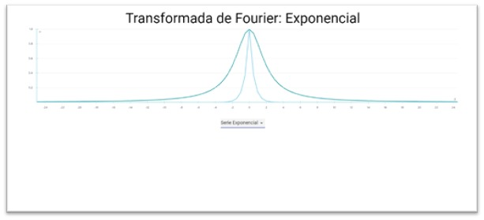
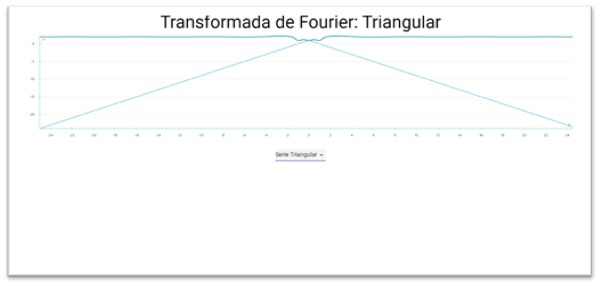
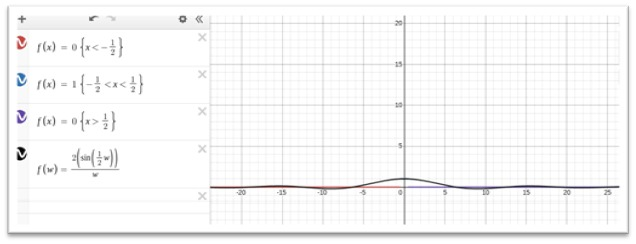
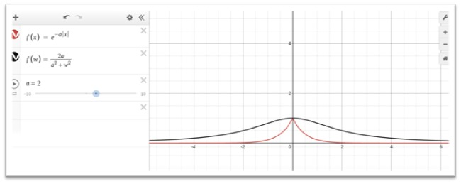

# Crear un proyecto de react

Siguiendo las instrucciones de [Create React App](https://github.com/facebook/create-react-app).
`npm install -g create-react-app`
`create-react-app practicaserie`
`cd practicaserie`

## Paquetes usados:
### React-vis
`npm install react-vis`

### Material-UI
`npm install @material-ui/core`
`npm install fontsource-roboto`

Ahora sustutuir el archivo App.js de la carpeta src en su proyecto.

Para correr el proyecto usar en el directorio del proyecto:
### `npm run start`

Abrir [http://localhost:3000](http://localhost:3000) para visualizar en el navegador.

### Vistas del programa
La práctica consta de un gráfico que muestra la representación de la transformada de Fourier seleccionada en la lista de opciones.

 Las gráficas definidas en el programa son:
 
 
 
 
 
 Cuyas aproximaciones en un graficador son:
 
 
 
 
 
